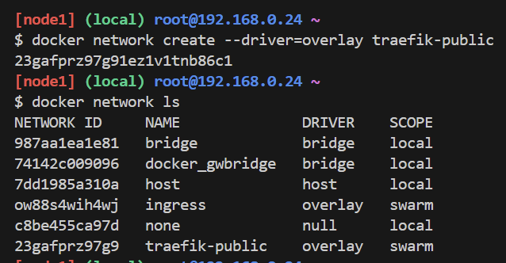

# 🚀 Deploying FastAPI + Traefik on Docker Swarm (Play with Docker)

## 1. 🎯 Goal
Set up a **FastAPI** API behind **Traefik** on a Docker Swarm cluster hosted on **Play with Docker** (PWD), with:
- API accessible at **https://admin.tahaidrissi.digital**
- Traefik dashboard at **https://traefik.tahaidrissi.digital**
- SSL certificates via **Let’s Encrypt**

---

## 2. 🛠 Prerequisites
- **Play with Docker** account: https://labs.play-with-docker.com
- A domain with two **A records** pointing to your current PWD node public IP:
  - `admin.tahaidrissi.digital` → `<PWD_PUBLIC_IP>`
  - `traefik.tahaidrissi.digital` → `<PWD_PUBLIC_IP>`


---

## 3. 📜 Deployment Steps

### 1) Initialize Docker Swarm
```bash
docker swarm init --advertise-addr `<PWD-IP>`
```


### 2) Create public overlay network
```bash
docker network create --driver overlay public
```



### 3) Prepare ACME storage
```bash
touch acme.json && chmod 600 acme.json
```

### 4) Deploy Traefik
```bash
docker stack deploy -c traefik-stack.yml traefik
docker service ps traefik_traefik
docker service logs traefik_traefik -f --tail=100
```


### 5) Deploy FastAPI service
```bash
docker stack deploy -c app-stack.yml monapi
docker service ps monapi_api
docker service logs monapi_api -f --tail=100
```

---

## 4. 🐞 Common Issues & Solutions

### **A) "port is missing"**
Cause: A service with `traefik.enable=true` but no `loadbalancer.server.port`  
Solution: Add a valid `traefik.http.services.<name>.loadbalancer.server.port` label or disable Traefik for that service.


---

### **B) ACME HTTP-01 challenge timeout**
error msg="Unable to obtain ACME certificate for domains \"traefik.tahaidrissi.digital\": unable to generate a certificate for the domains [traefik.tahaidrissi.digital]: error: one or more domains had a problem:\n[traefik.tahaidrissi.digital] invalid authorization: acme: error: 400 :: urn:ietf:params:acme:error:connection :: 52.186.22.183: Fetching http://traefik.tahaidrissi.digital/.well-known/acme-challenge/JpC6VfqKR-QX9blkh9Qh7waYdgl9dm3wsrcS1V2gDcA: Timeout during connect (likely firewall problem)\n" rule="Host(`traefik.tahaidrissi.digital`)" providerName=default.acme ACME CA="https://acme-v02.api.letsencrypt.org/directory" routerName=traefik@docker

---

### **C) 404 on API domain**
---
## 5. 🔍 Network Diagram

```plaintext
+-----------+         +-----------+         +----------+
|   Client  | <-----> |  Traefik  | <-----> | FastAPI  |
+-----------+   80/443+-----------+  port 80+----------+
                      Overlay Network: public
```

---
## 6. ✅ Verification

- Dashboard: [https://traefik.tahaidrissi.digital](https://traefik.tahaidrissi.digital)
- API: [https://admin.tahaidrissi.digital/docs](https://admin.tahaidrissi.digital/docs) (FastAPI Swagger)

---

## 7. 📌 Notes for Play with Docker
- PWD IPs are **ephemeral** — update DNS records each session.
- DNS propagation may take a few minutes before ACME succeeds.